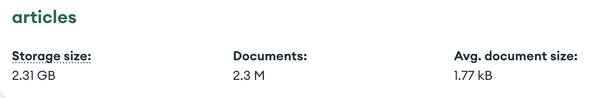

# Proyecto 2 - Bases de Datos II

### Integrantes
* Valeria Espinoza Tarazona (202110109)
* Enzo Camizán Vidal (202110047)
* Diego Guerra Chevarría (202010137)
* Valentín Quezada Amour (202120570)
* Sofía García Quintana (202110567)

## Introducción
La recuperación de información y lectura en documentos de texto consiste en un procedimiento con trasfondo algorítmico un tanto complejo y bastante interesante. Hoy en día, existe una amplia variedad de técnicas y algoritmos planteados para realizar búsquedas en archivos textuales, manteniendo una efectividad precisa y buscando la mayor eficiencia posible. A continuación, se experimentará con el método del índice invertido en la búsqueda de textos para el dataset de ArXiv, el servicio open source de distribución de archivos.

### Objetivo del proyecto
El presente proyecto está enfocado en la construcción óptima de un índice invertido para tareas de búsqueda y recuperación en documentos de texto. Consistirá en la implementación de un sistema backend-frontend, con código de lenguaje Python en el backend y una GUI intuitiva como frontend. El objetivo principal será comparar el desempeño computacional de nuestra implementación propia del índice invertido con el de los gestores de bases de datos PostgreSQL y MongoDB. Nuestra GUI será capaz entonces de mostrar resultados para los tres escenarios, y a partir de ello, analizaremos los tiempos de ejecución para determinar la eficiencia de nuestro índice invertido.

### Descripción del dominio de datos
El dominio de datos escogido para este proyecto consiste en un conjunto de más de 2.2 millones de papers académicos almacenados en la base de datos de ArXiv (https://www.kaggle.com/datasets/Cornell-University/arxiv). La gran mayoría de estos archivos están enfocados en las disciplinas de física, matemática, ingeniería, biología, ciencias de la computación, y entre otras áreas académicas. Cada entrada en este repositorio cuenta con el título de su artículo, el autor, las categorías que abarca, un corto resumen de su contenido y su fecha de actualización. Fue escogido debido a la consistencia y simpleza de los atributos seleccionados para cada fila, además de contar con una cantidad considerable de data para trabajar.

<div align="center">
 
</div>

A continuación, una descripción breve de los tipos de datos manejados en cada campo del dataset:
- id (string): Identificador
- submitter (string): Remisor
- authors (string): Autores
- title (string): Título
- comments (string): Comentarios
- journal-ref (string): Referencia de revista
- doi (string): DOI
- report-no (string): Número de reporte
- categories (string): Categorías
- license (string): Licencia
- abstract (string): Resumen
- versions (lista de diccionarios): Versiones y sus fechas de publicación
- update_date (string): Fecha de actualización
- authors_parsed (lista de listas): Autores organizados en una lista

Este sería un ejemplo de una entrada del dataset:
``` json
"root": {
	"id": "0704.0001"
	"submitter": "Pavel Nadolsky"
	"authors": "C. Balazs, E. L. Berger, P. M. Nadolsky, C.-P. Yuan"
	"title": "Calculation of prompt diphoton production cross sections at Tevatron and LHC energies"
	"comments": "37 pages, 15 figures; published version"
	"journal-ref": "Phys.Rev.D76:013009,2007"
	"doi": "10.1103/PhysRevD.76.013009"
	"report-no": "ANL-HEP-PR-07-12"
	"categories": "hep-ph"
	"license": "NULL"
	"abstract": "A fully differential calculation in perturbative quantum chromodynamics is presented for the production of massive photon pairs at hadron colliders. All next-to-leading order perturbative contributions from quark-antiquark, gluon-(anti)quark, and gluon-gluon subprocesses are included, as well as all-orders resummation of initial-state gluon radiation valid at next-to-next-to-leading logarithmic accuracy. The region of phase space is specified in which the calculation is most reliable. Good agreement is demonstrated with data from the Fermilab Tevatron, and predictions are made for more detailed tests with CDF and DO data. Predictions are shown for distributions of diphoton pairs produced at the energy of the Large Hadron Collider (LHC). Distributions of the diphoton pairs from the decay of a Higgs boson are contrasted with those produced from QCD processes at the LHC, showing that enhanced sensitivity to the signal can be obtained with judicious selection of events."
	"versions": ["..."]
	"update_date": "2008-11-26"
	"authors_parsed": ["..."]
}
```

## Backend
El backend se desarrolló en lenguaje de programación Python, se desarrollaron APIs y rutas para cada método de indexación (PostgreSQL, MongoDB e implementación propia) a partir de la base de datos proporcionada.

### JSON to CSV
Por temas de facilidad en el manejo de la data, dividimos el archivo json recuperado de ArXiv en 3 archivos csv, procedimiento ejecutado en las siguientes líneas de código: 

``` python
df = []
# Modificar ubicación
with open("/Users/ValDLaw/Desktop/arxiv-metadata-oai-snapshot.json", "r") as f:
    #print("abierto")
    for line in f:
        data = json.loads(line)
        df.append(data)
        #print(data)

df = pd.DataFrame(df)
df = df.drop(columns=["doi", "journal-ref", "comments", "license", "report-no", "versions"])
df = df.replace('\n', ' ', regex=True)

# Modificar ubicación
df.to_csv("/Users/ValDLaw/Documents/GitHub/2023-1/BDD2/Proyecto2BDD2/dataset/arxiv-metadata.csv", header=True, index=False)

# Modificar ubicación
csv_file = '/Users/ValDLaw/Documents/GitHub/2023-1/BDD2/Proyecto2BDD2/dataset/arxiv-metadata.csv'
num_files = 3
df = pd.read_csv(csv_file)
rows_per_file = len(df) // num_files
split_dfs = [df[i*rows_per_file:(i+1)*rows_per_file] for i in range(num_files)]

for i, split_df in enumerate(split_dfs):
    split_df.to_csv(f'arxiv-metadata-{i+1}.csv', index=False, header=None, sep=',')
 ``` 

### Preprocesamiento
El preprocesamiento de la data se realizó en un código aparte, llamado ```preprocesamiento.py```. Los procesos realizados fueron la tokenización del texto, el filtrado de las stopwords y caracteres especiales y la reducción de palabras con el método de stemming.

**preprocesamiento.py**

`tokenizar(texto)`:
 recibe como input un texto que pasa a minúsculas y luego utiliza "word_tokenize" de NLTK. Devuelve una lista de tokens.

`eliminarStopWords(tokenText)`: recibe una lista de tokens como entrada y elimina los stopwords. También hace un proceso de stemming utilizando "SnowballStemmer" de NLTK para reducir las palabras a su forma raíz. Devuelve una lista de tokens procesados.

`preprocesar_query(query)`: toma una consulta de texto como entrada y la procesa utilizando `tokenizar` y `eliminarStopWords`. Devuelve una lista de tokens procesados.

`preprocesar_textos(textos)`: es de forma muy similar a `preprocesar_query`, pero para los documentos propuestos.

### Construcción del índice invertido

Para implementar nuestro propio índice invertido, primero realizamos el cálculo de los pesos TF-IDF, estructurado en el siguiente archivo:

**tfidf.py**

`compute_tf(collection)`: toma una colección de documentos como entrada y calcula la frecuencia de término (tf) para cada término en cada documento. Devuelve un diccionario "doc_tf" que contiene la frecuencia de término de cada documento, y un diccionario llamado "total_tf" que contiene la suma total de la frecuencia de término de cada término en todos los documentos.

`compute_idf(term, idf_freq, term_freq, N)`: calcula la frecuencia inversa de documento (idf) para un término dado. Si el **idf** ya existe se devuelve. De lo contrario, se calcula contando en cuántos documentos aparece el término y usando la fórmula **idf = log10(N/df)**. **N** es el número total de documentos y **df** es el número de documentos en los que aparece el término. El **idf** calculado se almacena en el diccionario "idf_freq" y se devuelve.

`cosine_sim(Q, Doc)`: calcula la similitud coseno entre dos vectores: consulta (Q) y documento (Doc). Utiliza np.dot para realizar el producto escalar de los dos vectores y np.linalg.norm para calcular las normas. Devuelve el resultado de la similitud coseno redondeado a 3 decimales.

`create_inverted_index(textos_tfidf)`: crea y muestra la matriz de similitud coseno entre todos los documentos en el conjunto de textos representado por "textos_tfidf".

`compute_tfidf(collection)`: calcula el **tf-idf** para cada término en cada documento en la colección de documentos. Utiliza "compute_tf" para obtener la frecuencia de término. Además, se calcula y almacena la longitud (norma) de cada vector de documento en el diccionario "length". También se crea un índice invertido en "index", donde cada término se asigna a una lista de pairs que contienen el nombre del documento y la frecuencia del término en ese documento.

Luego, construimos el índice invertido a partir de los pesos, en un archivo aparte:

**index.py**

`building(self, textos)`: construye el índice invertido a partir de una colección de textos. Utiliza la función "preprocesar_textos" y luego usa "compute_tfidf" para obtener el índice invertido, la frecuencia inversa de documento (idf) y la longitud de los vectores de documento. Luego guarda todo en el archivo especificado por "index_file" utilizando el método "save_index".

`retrieval(self, query, k)`: realiza una consulta en el índice invertido. Recibe como input la query de texto y una cantidad **k** de documentos más relevantes que se quiere recuperar. Se preprocesa de la consulta con "preprocesar_query" y calcula el **tf-idf** del query y el score de similitud coseno entre el query y los documentos. Se ordena los documentos de forma descendente y regresa los **k** más relevantes.

`save_index(self, filename)`: guarda el índice invertido, el **idf** y la longitud de los vectores de documento en un archivo "filename".

`load_index(self, filename)`: carga el índice invertido, el **idf** y la longitud de los vectores de documento desde un archivo "filename".

### Manejo de memoria secundaria

A continuación, se explicará la implementación del índice invertido a partir del método de **Single-pass in-memory indexing (SPIMI)**. Este método consiste en la construcción de bloques a partir de los términos (y no específicamente sus índices), creando diccionarios para cada bloque y respetando el espacio limitado a cada uno para la memoria secundaria, en la cual luego serán escritos y fusionados con la función **merge**.

<div align="center">
 
</div>

### Ejecución óptima de consultas

Para realizar una consulta en nuestro buscador, se ingresará (en lenguaje natural) el tema deseado y la cantidad de documentos relacionados al tema (top k) que el usuario gustaría que se le muestre. Se hará entonces un llamado a las funciones del backend tomando los atributos de la query como ```string```, y el valor de k como ```int```.

<div align="center">
 
</div>

Al ejecutar la consulta, se seguirán las siguientes pasos, independientemente del índice aplicado:
- Se realiza un preprocesamiento interno de la query, pues pasa por un proceso de stemming para reducir cada palabra a su raiz.
- Se calculan el peso tf_idf y la norma de la query.
- Se calculan el peso tf_idf y la norma de los documentos relacionados a los términos del query.
- Se determinan los scores basado en los cálculos anteriores y usando el método de la similitud de coseno.
- Se genera una lista ordenada de los top k elementos que se aproximan a la consulta y se retorna al usuario en el frontend.

## Frontend
Para el frontend, se utilizó el lenguaje de programación JavaScript junto con el framework de Vue. Al desarrollar la GUI, se intentó hacer de forma que fuese intuitiva para el usuario, insertando consultas con facilidad y proporcionando los botones respectivos para la elección del índice de búsqueda (PostgreSQL, MongoDB o implementación propia).

### Carga e indexación de documentos  
- Instauramos una base de datos con nombre 'Proyecto2BDD2' y creamos la tabla Articles con el siguiente comando:  
``` sql
CREATE TABLE article (
	id VARCHAR(255) PRIMARY KEY,
	submitter TEXT,
	authors TEXT,
	title TEXT,
	categories TEXT,
	abstract TEXT,
	update_date DATE,
	authors_parsed TEXT
);
```

- Nos conectamos a nuestra Database desde el terminal y ejecutamos los siguientes comandos para poder insertar todos los valores del csv a nuestra tabla:  
``` sql
\copy article FROM '../dataset/arxiv-metadata-1.csv' WITH (FORMAT CSV, DELIMITER ',', QUOTE '"', HEADER);
\copy article FROM '../dataset/arxiv-metadata-2.csv' WITH (FORMAT CSV, DELIMITER ',', QUOTE '"', HEADER);
\copy article FROM '../dataset/arxiv-metadata-3.csv' WITH (FORMAT CSV, DELIMITER ',', QUOTE '"', HEADER);
```  

### Búsqueda textual 
- Creamos el archivo *postgres.py* con una API de ruta única '/consultas', en la cual recibíamos como parámetros el texto de búsqueda y un entero k. Esta nos devolvía una lista con el top k de los artículos que hacian match y el tiempo de ejecución de la consulta.  

``` python
@app.route('/consulta', methods=['POST'])
def consulta():
    data = request.get_json()
    parametro = data['parametro']
    k = data['k']

    cursor = conn.cursor()
    conn.rollback()

    # Ejecutar la consulta en PostgreSQL y medir el tiempo de ejecución
    start_time = time.time()
    query = "SELECT * FROM article WHERE vectorized_content @@ plainto_tsquery('english', %s) LIMIT %s;"
    cursor.execute(query, (parametro, k))
    resultados = cursor.fetchall()
    end_time = time.time()

    tiempo_ejecucion = end_time - start_time

    cursor.close()
    print(resultados)

    response = {
        'resultados': resultados,
        'tiempo_ejecucion': tiempo_ejecucion
    }

    return jsonify(response)
```  

- A la vez, creamos el archivo *mongodb.py* con una API de ruta única '/consultas', en la cual recibíamos como parámetros el texto de búsqueda y un entero k. Esta nos devolvía una lista con el top k de los artículos que hacian match y el tiempo de ejecución de la consulta.   
 ``` python
@app.route('/consulta', methods=['POST'])
def consulta():
    data = request.get_json()
    parametro = data['parametro']
    k = data['k']

    db = client['Proyecto2BDD2']  # Nombre de la base de datos en MongoDB
    collection = db['articles']  # Nombre de la colección en MongoDB

    # Ejecutar la consulta en MongoDB y medir tiempos
    start_time = time.time()
    resultado = collection.find(
    { '$text': { '$search': parametro } },
    { 'score': { '$meta': 'textScore' } }).sort([('score', { '$meta': 'textScore' })]).limit(k)
    end_time = time.time()

    # Convertir los resultados en una lista de diccionarios
    resultados_lista = []
    for documento in resultado:
        documento['_id'] = str(documento['_id'])
        resultados_lista.append(documento)

    tiempo_ejecucion = end_time - start_time

    response = {
        'resultados': resultados_lista,
        'tiempo_ejecucion': tiempo_ejecucion
    }
 ```  
(!)

### Diseño del índice con PostgreSQL
Para la implementación del índice con PostgreSQL, se siguió esta serie de pasos:

Añadimos la columna ```vectorized_content``` y la llenamos de la siguiente manera:  
``` sql
ALTER TABLE article ADD COLUMN vectorized_content TSVECTOR;
UPDATE article SET vectorized_content = setweight(to_tsvector('english', title), 'A') || setweight(to_tsvector('english', abstract), 'B') || setweight(to_tsvector('english', authors), 'C');
```

Creamos un índice GIN en la columna:  

``` sql
CREATE INDEX indexado_gin_index ON ARTICLE USING GIN(vectorized_content);
```  

Notamos que la query empleada fue la siguiente:  

``` sql
SELECT * FROM article WHERE vectorized_content @@ plainto_tsquery('english', %s) LIMIT %s;
```  

### Diseño del índice con MongoDB  
Para la implementación del índice con MongoDB, se siguió esta serie de pasos:
Importamos los datos del archivo 'arxiv-metadata-oai-snapshot.json' a nuestra Database en MongoDB usando la herramiento Import de MongoDB Compass. Luego, creamos una colección llamada **articles**.  
  

Luego, creamos el índice compuesto en nuestra colección, utilizando los campos *title*, *abstract* y *authors*.    

Notamos que la query empleada fue la siguiente:  
 ``` c++
resultado = collection.find(
    { '$text': { '$search': parametro } },
    { 'score': { '$meta': 'textScore' } }).sort([('score', { '$meta': 'textScore' })]).limit(k)
 ```  

### Diseño del índice invertido por implementación propia

Para la implementación propia del índice invertido desde la API en Flask seguimos los siguientes pasos:

Recibimos en un POST la query de búsqueda y la cantidad de "k" resultados requeridos en formato JSON.

Cargamos los datos del archivo CSV con la información de los documentos. Usamos la función `loadData` para cargar los datos en un DataFrame de pandas.

Luego importamos el índice invertido desde un archivo de texto utilizando la función `load_Index`. Esto nos da una lista de tuplas que representan los términos y sus documentos asociados con los valores de tf-idf. Para procesar una consulta, preprocesamos la query y calculamos su tf-idf.

Ejecutamos `retrieve_k_nearest` para obtener los k mejores resultados en base a la puntuación de similitud calculado con la función `cos_Similarity`.

Además, medimos el tiempo de ejecución, y devolvemos el siguiente JSON:

``` json
    {
        'resultados': resultados_dict,
        'tiempo_ejecucion': tiempo_ejecucion
    }
```

En este caso, nosotros sólo utilizamos el *abstract* para calcular el índice invertido y la similitud entre los documentos y la query, a diferencia de PostgreSQL y MongoDB.

### Presentación de resultados


### Screenshots de la GUI
<div align="center">
 
 
 
</div>

## Análisis de resultados  
A continuación, explicaremos cada una de las técnicas empleadas y el porqué del tiempo de ejecución en cada caso.

### PostgreSQL  
El índice GIN (Generalized Inverted Index) en PostgreSQL es un tipo de índice utilizado para realizar búsquedas eficientes en campos que contienen múltiples valores o estructuras de datos complejas. A diferencia de los índices B-tree convencionales, el índice GIN es especialmente útil para columnas que almacenan arreglos, tipos de datos JSON, texto y otros tipos de datos no escalares.  

La importancia de usar el índice GIN en ente proyecto radica en su capacidad para indexar y buscar eficientemente los valores en campos como `title`, `abstract` y `authors`. El índice GIN permite una búsqueda más rápida y eficiente en estos campos, lo que es crucial cuando necesitamos realizar consultas que involucran similitud de cadenas y recuperar el top K de resultados más similares.  

### MongoDB  
Por otro lado, MongoDB utiliza un enfoque diferente para la indexación y búsqueda de texto. En MongoDB, se utiliza un índice de texto y el operador `$text` para realizar búsquedas de texto. El índice de texto en MongoDB puede proporcionar funcionalidades similares al índice GIN en PostgreSQL para realizar búsquedas basadas en la similitud de texto.  

En términos de rendimiento y velocidad, MongoDB puede ofrecer ciertas ventajas debido a su arquitectura y características específicas. MongoDB utiliza un modelo de almacenamiento orientado a documentos y puede escalar horizontalmente para manejar grandes volúmenes de datos y cargas de trabajo intensivas. Además, MongoDB está diseñado para tener un rendimiento rápido en consultas de texto mediante el uso de índices de texto y algoritmos de búsqueda eficientes. 

Sin embargo, la eficacia y la velocidad de las consultas pueden depender de varios factores, como el tamaño de los datos por cada artículo, la estructura de la consulta, la configuración del hardware y otros aspectos específicos del caso de uso del proyecto. Es importante tener en cuenta que tanto PostgreSQL como MongoDB ofrecen opciones y características adicionales para optimizar el rendimiento de las consultas, como la optimización de consultas, el ajuste de índices y la configuración adecuada del entorno de base de datos.   

### Implementación propia

En nuestra implementación utilizamos Single-pass in-memory indexing, por lo que dividimos el índice en bloques más pequeños, lo que facilita su almacenamiento y manejo. Cada bloque se guarda en un archivo JSON para una gestión eficiente de los datos. Además, dado que hacemos el procesamiento en memoria secundaria, no es necesario que todo entre en la memoria principal, especialmente cuando tratamos grandes cantidades de datos. 

Nuestra implementación facilita las búsquedas y consultas eficientes en el índice invertido. Algo importante a resaltar es que los resultados varían ligeramente en comparación a los que devuelven PostgreSQL y MongoDB. Esto ocurre porque las bases de datos utilizan los campos *title*, *abstract* y *authors*, mientras que nuestra implementación sólo usa el *abstract*.

## Conclusiones

Este trabajo nos ha permitido comprender diferentes enfoques para realizar búsquedas en bases de datos, desde la construcción de índices invertidos utilizando SPIMI hasta el uso de las soluciones que usan MongoDB y PostgreSQL. Cada enfoque tiene sus propias ventajas y desventajas, y la elección dependerá de los requisitos del proyecto, el tamaño del conjunto de datos y las funcionalidades requeridas. Es importante evaluar las opciones disponibles y considerar aspectos como el rendimiento, la escalabilidad y la flexibilidad para garantizar búsquedas eficientes y precisas en bases de datos.

## Video de presentación
Link: https://drive.google.com/drive/folders/1U48aPt0ut44t6mqqrnoklbXk1oAqpkhT?usp=sharing
